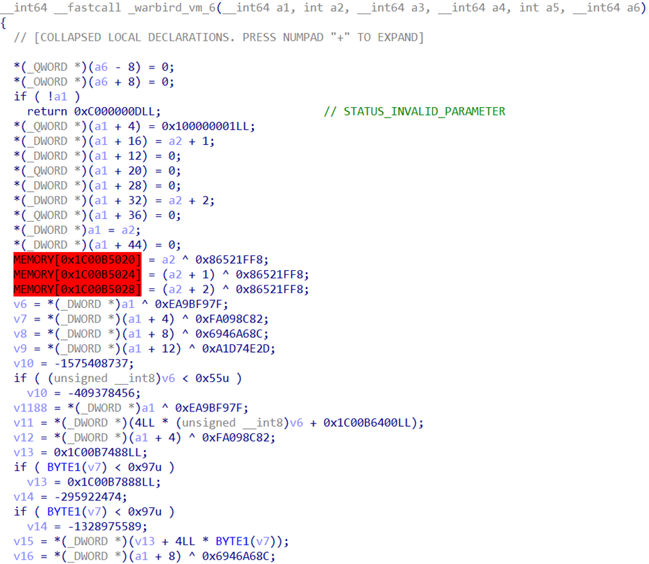
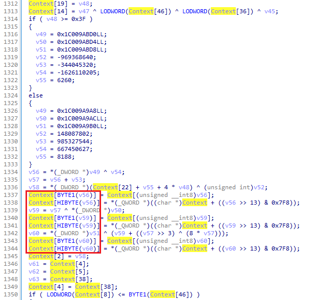
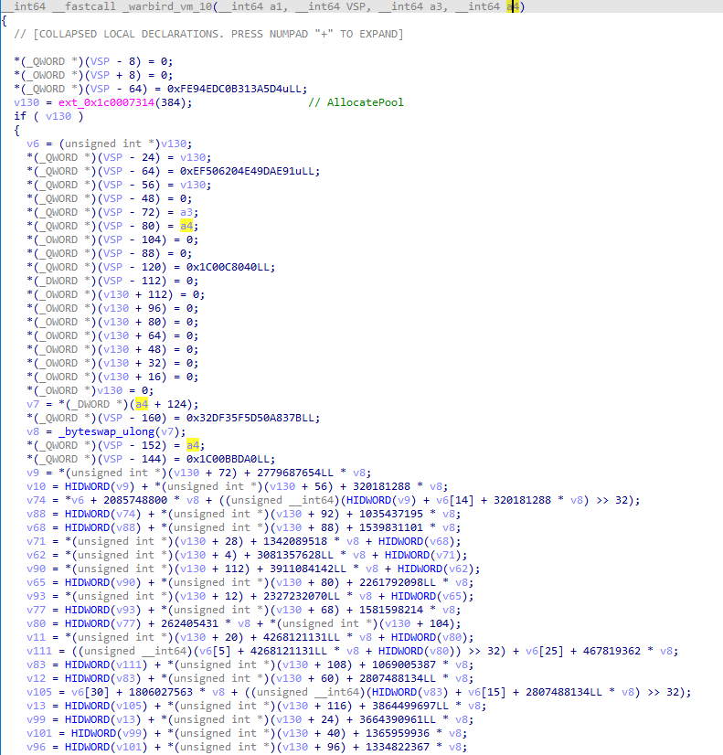
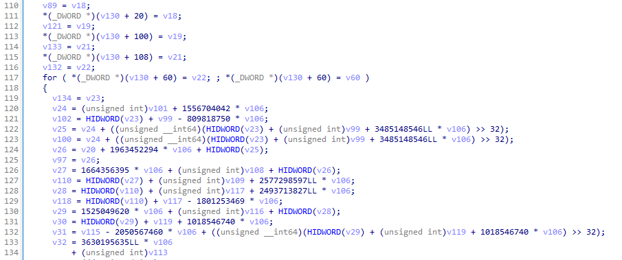

# NoWarbird - Warbird devirtualization attempt

NoWarbird is a devirtualization project inspired by https://github.com/airbus-seclab/warbirdvm. The main goal of this project was to see how devirtualized binary would look like as well as to learn [REMILL](https://github.com/lifting-bits/remill).

The devirtualization idea is simple:
- Lift each handler into separate LLVM function
- Concretize key and simplify 
- Find next handler to explore
- Repeat until no new handlers found
- Build final LLVM function by chaining calls to handler functions

## Results

### ci.dll

```
./build/warbird-lifter --handlers-va 0x1C00B9B20 --key 0xFAF1D7C599A70ADD --binary data/ci.dll --intrinsics intrinsics/intrinsics.ll -stats
./build/warbird-lifter --handlers-va 0x1C00B9B20 --key 0x5AE67008BCF20E68 --binary data/ci.dll --intrinsics intrinsics/intrinsics.ll -stats
./build/warbird-lifter --handlers-va 0x1C00B9B20 --key 0x2BCB62DCCD8476A8 --binary data/ci.dll --intrinsics intrinsics/intrinsics.ll -stats
./build/warbird-lifter --handlers-va 0x1C00B9B20 --key 0xC11B999C187B4D0E --binary data/ci.dll --intrinsics intrinsics/intrinsics.ll -stats
./build/warbird-lifter --handlers-va 0x1C00B9B20 --key 0x5D168CB62BBFB4A9 --binary data/ci.dll --intrinsics intrinsics/intrinsics.ll -stats
./build/warbird-lifter --handlers-va 0x1C00B9B20 --key 0x83A892154132EF92 --binary data/ci.dll --intrinsics intrinsics/intrinsics.ll -stats
```

The cleanest vm to analyze, AES key is present in plain site:




### ClipSp.sys

```
./build/warbird-lifter --handlers-va 0x1C00392F0 --key 0xdd2db593fd3f965b --binary data/ClipSp.sys --intrinsics intrinsics/intrinsics.ll -stats
```

The ugliest VM of them all. It decrypts (or encrypts) 48 bytes (I'm not sure) using vm context as an array:


Because of this, llvm can't propagate loads & stores to context and the binary size increased at least 3 times.

### PEAuth.sys

```
./build/warbird-lifter --handlers-va 0x1C00BE2A0 --key 0x36C23CED3AE0067F --binary data/PEAuth.sys --intrinsics intrinsics/intrinsics.ll --handlers-count 4096 -stats
./build/warbird-lifter --handlers-va 0x1C00BE2A0 --key 0x54FBDBC57D84C904 --binary data/PEAuth.sys --intrinsics intrinsics/intrinsics.ll --handlers-count 4096 -stats
./build/warbird-lifter --handlers-va 0x1C00BE2A0 --key 0x71230978383912F6 --binary data/PEAuth.sys --intrinsics intrinsics/intrinsics.ll --handlers-count 4096 -stats
./build/warbird-lifter --handlers-va 0x1C00BE2A0 --key 0xCDD752B6329244D2 --binary data/PEAuth.sys --intrinsics intrinsics/intrinsics.ll --handlers-count 4096 -stats
```

VMs `0x36C23CED3AE0067F` and `0x54FBDBC57D84C904` only decrypt 1st argument into the 2nd one, nothing special. On the other hand, `0x71230978383912F6` and `0xCDD752B6329244D2` allocate 384 bytes and fill it using data from the 2nd argument:


I think something broken with my tool because there's an infinite loop (had no time to look into it):

